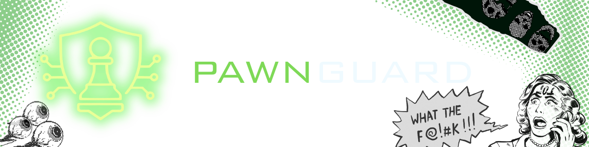

<!-- ============================================================ -->
<!--                     PAWNGUARD — README                       -->
<!-- ============================================================ -->

  <!-- Replace the URL below with your actual banner image -->
  

   

  ### *We protect what matters — one move ahead.*

  > PawnGuard construye open-source software

   

  <!-- ── Social / Status Badges ── -->
  

---

## 🧭 Who We Are

PawnGuard is an open-source organization focused on building developer-first security tools.
We believe security shouldn't be an afterthought — it should be a natural part of every commit,
every review, and every deployment.

We move like the pawn: steady, purposeful, and always advancing. 🛡️

---

## 🚀 Featured Projects

| Project | Description | Stack | Stars |
|---|---|---|---|
| ♟️ [**Hack2Dawn**](https://github.com/PawnGuard/hack2dawn-front-end) | Core security scanning engine for CI/CD pipelines | NextJS · CTFd |

> 📌 Also check our **[pinned repositories](https://github.com/PawnGuard)** for the most up-to-date highlights.

---

## 👥 Core Team

  <table>
    <tr>
      <td align="center">
        <a href="https://github.com/varfmx21">
           
          <b>varfmx21</b>
        </a> 
        Founder · DevSecOps Eng
      </td>
      <td align="center">
        <a href="https://github.com/JRV-XVI">
           
          <b>Shadow</b>
        </a> 
        Co-founder · Backend
      </td>
      <td align="center">
        <a href="https://github.com/sammy-ulfh">
           
          <b>Sammy</b>
        </a> 
        DevOps · Cyber Eng
      </td>
    </tr>
  </table>

---

## 📡 Connect With Us

  
  
  

   
  © 2026 PawnGuard · Built with ♟️ and a lot of ☕

